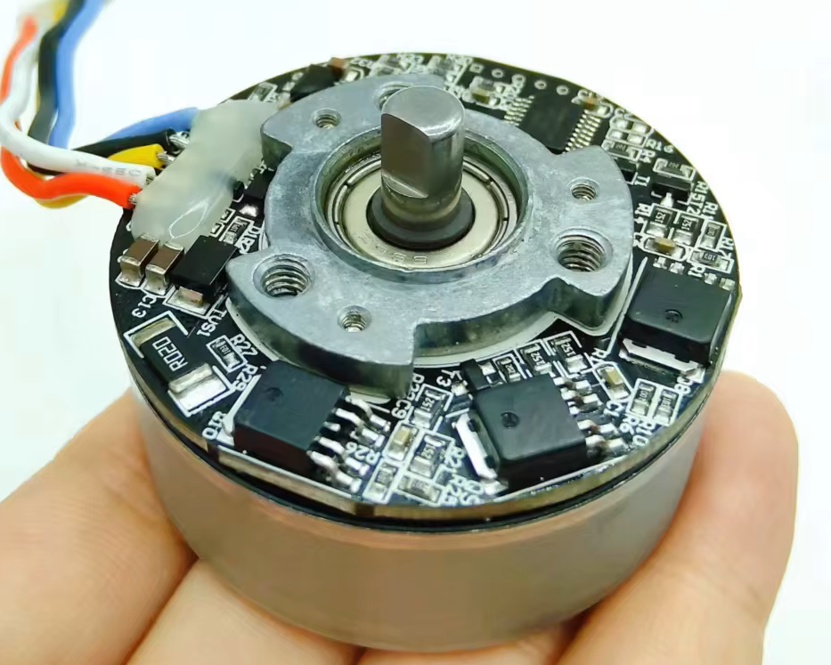
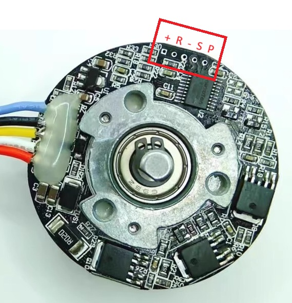

# BL4818-Servo: Custom Firmware for BL4818 Brushless Motor Drivers

Custom open-source firmware for the inexpensive BL4818 "massage gun" / "fascia gun"
brushless motor driver boards, turning them into low-cost servo drives.

## Motivation

BL4818 integrated brushless motor driver boards are available from China for a few
dollars. They contain everything needed for a basic brushless servo drive:

- Nuvoton MS51FB9AE microcontroller (8051 core, 16KB flash)
- Three hall effect sensors for rotor position
- Complementary three-phase MOSFET bridge (no gate drivers)
- Low-side current shunt resistor for overcurrent protection (no amplifier)
- PWM speed input and direction control pin

The stock firmware has several limitations that prevent use as a servo:

1. **Poor stall behavior** — the motor quickly gives up and stops driving if stalled for any reason, making it impossible to use as a servo motor. 
2. **Direction change requires stop** — the direction input is ignored unless the
   motor is completely stopped, making closed-loop position control difficult.
3. **Low Acceleration** 
4. **No serial interface** — no way to command position/velocity/torque targets

This project is a minimal rewrite to fix these issues.

## Hardware

### Target Board

BL4818 brushless motor driver board (commonly sold for massage gun / fascia gun motors).

| Parameter          | Value                     |
|--------------------|---------------------------|
| MCU                | Nuvoton MS51FB9AE         |
| Architecture       | Enhanced 1T 8051, 24 MHz  |
| Flash              | 16 KB (APROM)             |
| RAM                | 256B IRAM + 1KB XRAM      |
| Package            | TSSOP-20                  |
| Supply Voltage     | 12V DC                   |
| Logic Voltage      | 5V (onboard regulator)   |
| Bridge             | 3-phase complementary (P+N pair per phase) |
| Position Sensing   | 3× Hall effect sensors    |
| Current Sensing    | Low-side shunt resistor   |

### Pin Mapping (MS51FB9AE TSSOP-20)

From the official Nuvoton datasheet:

```
Pin  Port   Key Functions                      Board Connection
───  ─────  ─────────────────────────────────  ─────────────────────
 1   P0.5   T0 / PWM0_CH2 / ADC_CH4           Tach output (N-FET inverted)
 2   P0.6   UART0_TXD / ADC_CH3               Current shunt (direct, no amp)
 3   P0.7   UART0_RXD / ADC_CH2               Battery voltage (10k/10k divider)
 4   P2.0   nRESET                             Prog header "R"
 5   P3.0   INT0 / ADC_CH1                     Hall sensor 3
 6   P1.7   INT1 / ADC_CH0                     Hall sensor 2
 7   VSS    Ground                             GND
 8   P1.6   ICE_DAT / UART1_TX / [I2C0_SDA]   Prog header "P"
 9   VDD    Power (2.4–5.5V)                   5V from regulator
10   P1.5   PWM0_CH5 / SPI0_SS                 Hall sensor 1
11   P1.4   PWM0_BRAKE / PWM0_CH1              Direction input
12   P1.3   I2C0_SCL                           NC (available for expansion)
13   P1.2   PWM0_CH0                           Phase U low-side gate
14   P1.1   ADC_CH7 / PWM0_CH1                 Phase U high-side gate
15   P1.0   PWM0_CH2 / SPI0_CLK                Phase V high-side gate
16   P0.0   PWM0_CH3 / SPI0_MOSI / T1         Phase V low-side gate
17   P0.1   PWM0_CH4 / SPI0_MISO               Phase W low-side gate
18   P0.2   ICE_CLK / UART1_RX / [I2C0_SCL]   Prog header "S"
19   P0.3   ADC_CH6 / PWM0_CH5                 Phase W high-side gate
20   P0.4   ADC_CH5 / PWM0_CH3 / STADC         PWM speed input (unpop RC)
```



**Programming header** (silkscreen: P, R, S, +, −):
P = ICE_DAT (pin 8), R = nRESET (pin 4), S = ICE_CLK (pin 18),


\+ = VDD (pin 9), − = GND (pin 7)

> All pin assignments confirmed by multimeter probing.
> See [docs/pinout.md](docs/pinout.md) for detailed circuit notes.

### UART

For serial communication, use **UART1** on the programming header pads:
UART1_TX = P1.6 (pin 8, header "P"), UART1_RX = P0.2 (pin 18, header "S").

## Features

### Implemented

- [x] Six-step (trapezoidal) commutation from hall sensors
- [x] lowside PWM (the high side fets are slow, so we switch then only once per sector)
- [x] Current limiting via shunt ADC. limit is configurable by Serial port
- [x] UART1 binary ring protocol for duty / torque control. Many morors can be daisy chained and commanded with a dingle serial frame, or addressed individually.
- [x] Firmware image consumes only ~25% of flash. Room for expansion.

## Building

### Prerequisites

- [SDCC](https://sdcc.sourceforge.net/) 4.2+ (Small Device C Compiler)
- GNU Make
- Raspberry Pi Pico or Pico 2 for programming the device with in-repo "nu-link" ISP/ICP bridge firmware and flash script. 

### Compile

```bash
make            # Build firmware (output: build/bl4818-servo.ihx)
make clean      # Remove build artifacts
make flash      # Flash via Nu-Link (requires nulink-cli or openocd)
make size       # Show flash/RAM usage
```

For board-level gate-drive validation without the motor-control stack, build the
minimal bench image instead:

```bash
make -f Makefile.bench
```

This produces `build/bl4818-bench.bin`, which exposes only UART1 and direct
single-gate GPIO control for power-stage probing.

Bench image commands:

- `X<mask>` drive raw gate mask directly
- `J<1..6>` drive one of the six static commutation states
- `R` or `J0` release all gates
- `?` or `H` report gate state plus raw hall state and hall transition count
- `Z` reset the hall transition count

### Toolchain Notes

This project uses **SDCC** (open-source) rather than Keil C51. SDCC is freely
available and produces comparable code for the 8051 target. The MS51 BSP headers
have been adapted from the [MS51BSP_SDCC](https://github.com/danchouzhou/MS51BSP_SDCC)
project.

### Bridge Recovery

The custom Pico ICP bridge in `nu-link/` now supports switched target power for unbricking bad MS51 config states.

- Use **GPIO10** on the Pico bridge as the enable signal for a **high-side switch** feeding the target MCU `VDD` pin on the programming header `+`.
- Keep bridge `GND`, `ICE_DAT`, `ICE_CLK`, and `nRESET` wired normally.
- Switch the **5V logic rail only**, not the motor supply.

Typical recovery flow:

```bash
python flash.py --recover
```

Useful manual controls:

```bash
python flash.py --target-power off
python flash.py --target-power on
python flash.py --power-cycle-connect --info
```

When the Pico bridge is idle, its secondary USB CDC "debug" port now passes
through the target MCU UART on the programming header pins. As soon as the host
starts a Nu-Link `CONNECT`/power-control session, that pass-through is disabled
so ICP can take over the same wires, then it resumes after the programming
session ends.

If the target only enters ICP at a narrow power-up window, sweep delays explicitly:

```bash
python flash.py --recover --power-off-ms 100 \
  --power-on-delay-us 50 --power-on-delay-us 100 --power-on-delay-us 250 \
  --power-on-delay-us 500 --power-on-delay-us 1000 --power-on-delay-us 5000
```

## Project Structure

```
├── README.md              This file
├── Makefile               Build system
├── Makefile.bench         Minimal gate-drive bench image build
├── bench/
│   └── bench_main.c       UART + direct gate GPIO validation image
├── include/
│   ├── ms51_reg.h         MS51FB9AE register definitions
│   ├── ms51_config.h      Clock, pin, and feature configuration
│   ├── pwm.h              PWM and dead-time control
│   ├── adc.h              ADC (current sense, voltage)
│   ├── commutation.h      Six-step commutation tables and logic
│   ├── hall.h             Hall sensor reading and state machine
│   ├── motor.h            Motor control 
│   ├── uart.h             UART1 driver with RX/TX ring buffers
│   ├── protocol.h         Production binary ring protocol
│   └── flash.h            IAP flash parameter storage
├── src/
│   ├── main.c             Entry point, init, main loop
│   ├── pwm.c              PWM setup and duty cycle control
│   ├── adc.c              ADC sampling and current measurement
│   ├── commutation.c      Commutation table and phase switching
│   ├── hall.c             Hall sensor ISR and state tracking
│   ├── motor.c            Motor state machine (run/brake/fault)
│   ├── pid.c              PID loop implementation
│   ├── uart.c             Interrupt-buffered UART1 RX/TX
│   ├── protocol.c         Binary ring protocol engine
│   └── flash.c            IAP read/write for parameters
└── docs/
    └── pinout.md          Detailed pinout and board photos
```

## Serial Protocol

Default: 250000 baud, 8N1 on UART1.

The production firmware now uses a binary ring protocol only:

- Enumeration
- Broadcast duty updates
- Addressed commands with fixed-length status responses
- CRC-8 on every production frame, plus no broadcast slot consumption before enumeration
- Legacy PWM+DIR input only before enumeration; first successful enumerate stops the motor and hands control to serial until reboot

The separate bench firmware keeps the ASCII bring-up commands.

See [protocol.md](protocol.md) for the wire format, transaction model, and examples.

For direct host-side validation of the binary protocol, use `ring_tool.py`.
It can enumerate, send broadcast duty packets, issue addressed commands, and
run a repeated broadcast-plus-status validation loop over a PC serial port.

Safety warning:

- This firmware accepts direct duty / torque commands and does not yet enforce a proven safe operating area for sustained stall, locked-rotor, or repeated high-load low-speed operation.
- Present protections are limited to a soft current pullback, a hard overcurrent fault, local-input ramping, and bounded local retries. Those help, but they are not a guarantee that the board, motor, or wiring cannot be overheated or damaged.
- A commanded full-duty stall can still be destructive, especially if an external master raises the torque limit or repeatedly re-applies command after fault recovery.
- The watchdog is only a hang-recovery mechanism. It can reset the MCU if the firmware stops making progress, but it does not by itself limit a still-running control loop that is actively commanding a bad operating point.
- Until a better thermal / `I^2t` style derate exists, test with a current-limited supply and conservative torque / duty settings.

Legacy `PWM+DIR` input notes:

- Before enumeration, `P0.4` PWM plus `P1.4` direction can still drive the motor.
- `P0.4` is treated as active-low because the board has a pull-up to 5 V. Idle/high means zero torque, which makes a floating or disconnected command input fail safe.
- PWM edges on `P0.4` are timestamped by Timer2 capture hardware rather than by software polling.
- Continuous active level on `P0.4` is also accepted: if the input is held low for about `20 ms`, the firmware treats that as full local command, matching the stock board's grounded-input behavior.
- Local command is slew-limited on the way up, so a step to full local input ramps from zero to full applied duty over about `100 ms` instead of hitting the bridge in one control tick.
- The first valid enumerate packet stops any locally driven motion and hands ownership to serial until reboot.
- If PWM edges disappear for more than `50 ms` and the input is not being held continuously active, the local command drops to zero.
- The default soft current limit is `3 A`, while the hard overcurrent fault remains `5 A`. That makes continuous grounded-input operation less aggressive out of the box; a serial master can still raise the torque limit explicitly.
- In pre-enumeration local mode, a faulted motor will auto-clear and retry up to `3` times with a `250 ms` delay between attempts as long as the local command stays nonzero. Returning the local command to zero resets that retry budget.
- Recommended PWM frequency is `50 Hz` to `2 kHz`. There is little benefit above `1 kHz` because the command is still applied on the `1 kHz` control tick.
- Timer2 runs with a `/16` prescale in this mode, so at `24 MHz` the capture timestamp granularity is about `0.67 us` and the 16-bit counter spans about `43 ms`, which comfortably covers `50 Hz` PWM.
- Because the edge timestamp is latched in hardware, ISR latency does not directly add measurement jitter. In practice the duty precision is now set mainly by timer quantization and input signal cleanliness, not by foreground firmware load.

## RP2350 Master Library

An Arduino-Pico / PlatformIO master-side library now lives in
`host/arduino-pico/BL4818RingMaster`.

- Library: `host/arduino-pico/BL4818RingMaster`
- Example project targeting Pico 2 W (`rpipico2w`): `host/arduino-pico/rpipico2w-master-example`
- Single-actuator AS5047 closed-loop testbench: `host/arduino-pico/rpipico2w-single-actuator-testbench`
