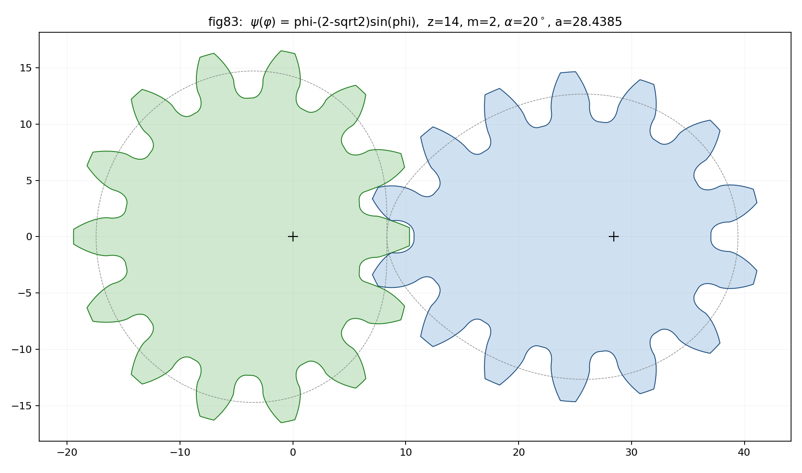

# Noncircular involute gear generator

Implementation of:

> Uwe Bäsel, *Determining the geometry of noncircular gears for given
> transmission function*, [arXiv:1905.02642](https://arxiv.org/abs/1905.02642) (2019).

Given a transmission function ψ(φ) (drive angle φ → driven angle γ = ψ(φ),
with ψ' > 0 and ψ(2π) = 2π), the generator computes the complete tooth
geometry of both gears as cut by a rack-cutter with profile angle α,
addendum h_a, dedendum h_f and tip fillet radius ρ, following the paper's
algorithm (Section 7):

* centrodes X_P (drive, eq. 2.8) and Ξ_P (driven, eq. 2.9) from ψ;
* pivot distance a from the centrode perimeter (eq. 2.14) and tooth centre
  angles χ(k) (eq. 3.3) by numerical integration/root finding;
* flank curves as rack-flank envelopes (Theorems 3.1 / 4.1), fillet curves
  as offset curves of the rack-corner-centre paths (eqs. 3.29 / 4.18),
  addendum/dedendum curves as centrode offsets (eqs. 3.25 / 4.15);
* undercut detection per flank via the involute singular point (eqs.
  5.2 / 5.11) and Theorems 5.1 / 5.2;
* trimming: flank ∩ addendum curve, and flank ∩ fillet curve in the
  undercut case (eqs. 7.1–7.14), computed with **CGAL exact segment
  intersections** on finely sampled curves, then Newton-polished in the
  curve parameters.

Two implementation notes that go beyond the paper:

* **Marginal undercut.** Just past the undercut limit the fillet curve is
  tangent to the *folded* involute branch behind the cusp (eq. 7.1 is
  satisfied at the contact point φ_B with φ_F = φ_A = φ_B) but does not
  transversally cross the valid branch. In that regime the flank is
  trimmed at its cusp, the fillet at φ_B, and the micro-gap (order
  10⁻³·m) is closed with a chord.
* **Offset-curve folds.** Near osculating flank/fillet junctions the
  fillet offset curve can develop a tiny cusp pair (fold). Folds are
  clipped at their self-intersection — the local boundary-of-union
  operation.

Validation:

* assembled profiles are checked with CGAL `Polygon_2::is_simple`;
* the pair is meshed over 12 poses (drive rotated by φ₀, driven by
  −ψ(φ₀)) and the mutual penetration area is computed with CGAL polygon
  Boolean operations — it is ~0 (≤ 10⁻⁶) for all samples;
* for the paper's example the program reproduces I(0,2π) ≈ 3.09315,
  a ≈ 28.4385, χ(k) of Table 8.1 and the singular points/curvatures of
  Table 8.2 to ~5·10⁻⁶ (the tables' printed precision), including the
  undercut pattern (only tooth 2 "−" and tooth 14 "+" undercut-free).

## Samples

| name | ψ(φ) | z | result |
|------|------|---|--------|
| `circular` | φ (b = 0) | 12 | ordinary spur gears, classic z<17 undercut |
| `fig83` | φ − (2−√2)·sin φ | 14 | the paper's Fig. 8.3 example |
| `oval2` | φ − 0.14·sin 2φ | 18 | two-lobed (elliptical-like) pair |
| `lobe3` | φ − 0.0533·sin 3φ | 24 | three-lobed pair |

Rack parameters for all samples: m = 2, α = 20°, h_a = m, h_f = 1.2·m,
ρ = 0.3·m. The amplitudes b are chosen near the largest value that keeps
the drive centrode convex (κ ≤ 0, cf. Section 8 of the paper: b ≤ 2−√2
for n = 1; the analogous limits are b ≤ (7−√41)/2 ≈ 0.298 for n = 2 and
b ≤ 6−√34 ≈ 0.169 for n = 3).

Rendered output in `samples/`: `<name>_pair.png` (the gear pair at pose
φ = 0, cf. Fig. 8.3), `<name>_gears.png` (each gear with pitch/addendum/
dedendum curves), `<name>_mesh.png` (meshing poses with pitch-point
zooms and per-pose CGAL overlap area).



## Build & run

```bash
sudo apt-get install libcgal-dev cmake g++   # and python3 + matplotlib
cmake -B build -S . -DCMAKE_BUILD_TYPE=Release
cmake --build build
./build/gear_gen out          # writes out/<name>.json + validation log
python3 render.py out samples # writes samples/<name>_{pair,gears,mesh}.png
```
